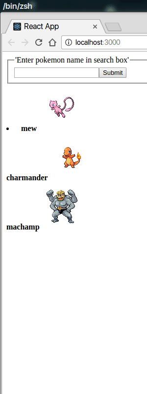

# Pokedex

> "A childhood dream in the making” :sunglasses:



PS. Basic skeleton to get started :sweat_smile:

## Introduction
The goal of __Pokedex__ is simple. Have an online Pokedex collection for anyone and everyone to access.
Make it more of a place to geek out about Pokemon :grin:

## Technologies
Build using React and Hack (Yeah you guessed it right, pretty new to all this)

## Dependencies
- redis
- Hack

## How to use
- Clone the repo
```Shell
git clone https://github.com/sandeepkumarpani888/Pokedex
```

- Navigate into the cloned repository
```Shell
cd Pokedex
```

- Install all `npm` modules
```Shell
npm install
```

- Start the deployment server using `npm start`
```Shell
npm start
```

- Start HHVM in server mode
```Shell
cd scripts
hhvm -m server -p 8080

- Basic framework at http://localhost:3000/
